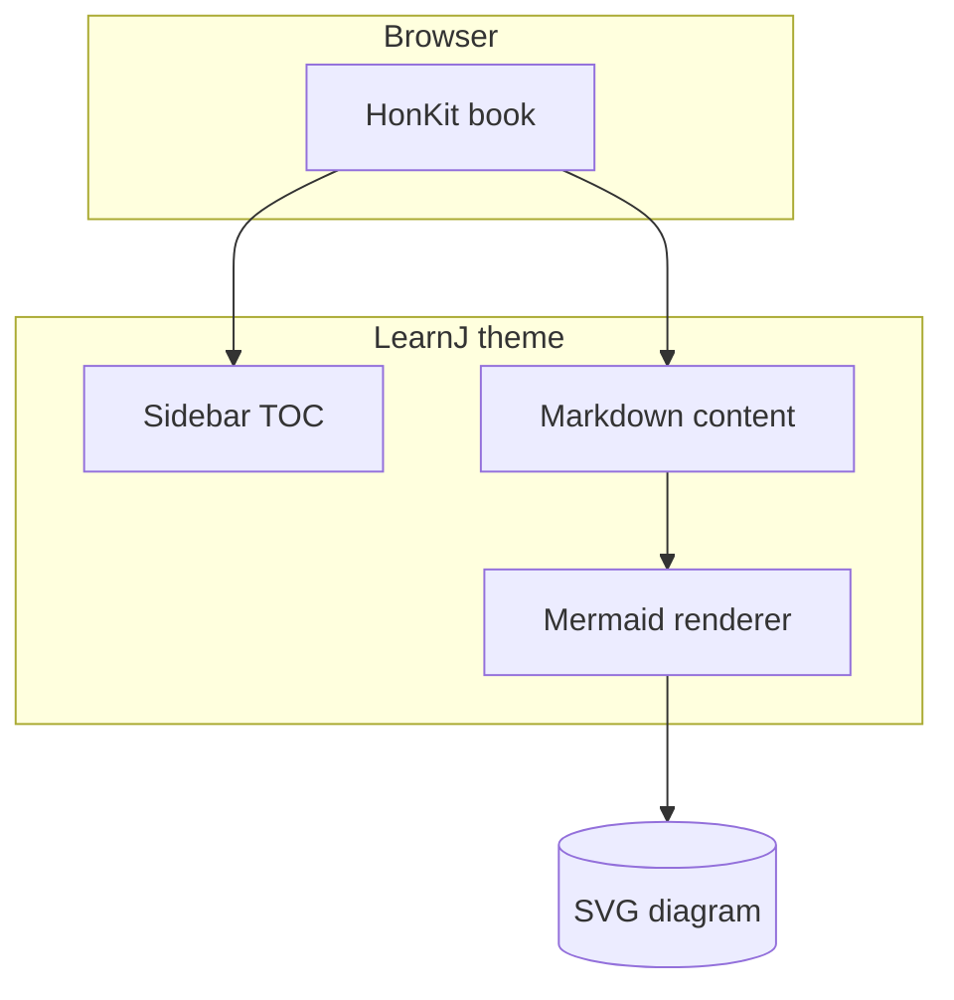
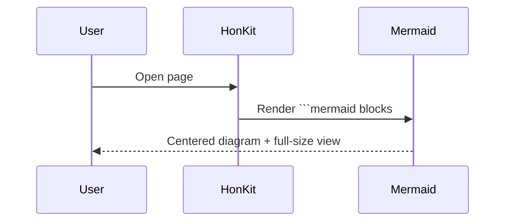

# Diagrams

Mermaid blocks render as **centered architecture diagrams**, not code panels. Use **View full size** (or click the diagram) to open a scrollable lightbox.

Install a Mermaid plugin in `book.json` (for example `mermaid-md-adoc`) to enable fenced `mermaid` code blocks.
